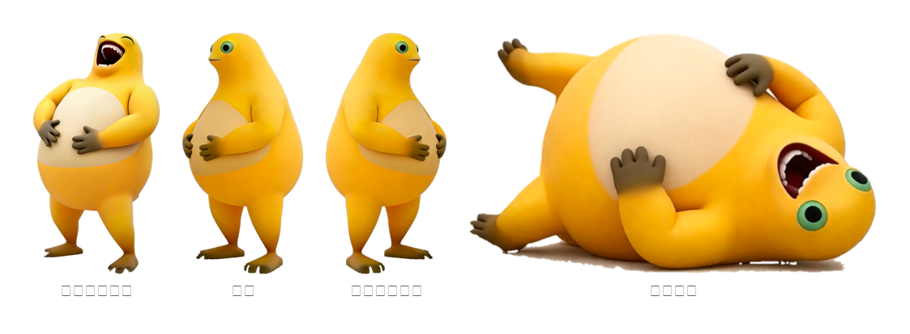

# 奶蛙桌宠 · NaiWa Pet

一只趴在屏幕上的桌宠，形象是网络上流传的表情包角色「奶蛙」。


它会自己呼吸、侧头张望、沿屏幕底边散步，可以用鼠标拎着走，点一下会弹一下。

## 下载

Windows x64 免安装单文件（约 46 MB，不需要装 Python）：

**→ [Releases / NaiWaPet.exe](https://github.com/trixster2/nai-wa-pet/releases/latest)**

> 双击即运行。程序没有做代码签名，首次启动 Windows 可能弹 SmartScreen 提示，
> 点「仍要运行」即可。

安卓没有发布 APK，要自己装到手机上见文末「跨平台」。

## 从源码运行

```bash
pip install PySide6
python pet.py              # 启动
```

打包成免安装单文件：

```bash
pip install pyinstaller
python build_exe.py        # 产出 dist/NaiWaPet.exe
```

素材是随仓库分发的现成 PNG，正常情况不需要重新生成；要重跑抠图：

```bash
python make_sprites.py     # 从 assets/ 重新生成 sprites/
python make_preview.py     # 重新生成 docs/ 里的 README 配图
```

## 怎么玩

| 操作 | 反应 |
| --- | --- |
| 按住拖动 | 拎着走，身体顺势倾斜拉长 |
| 单击 | 弹一下 |
| 右键 | 菜单：走动 / 停下 / 大小（小·中·大）/ 回到右下角 / 退出 |
| 什么都不做 | 自己呼吸，隔几秒侧头看一眼，再隔一会儿换成侧身帧沿底边散步，撞到屏幕边缘回头 |

## 从源码运行

```bash
pip install PySide6
python make_sprites.py     # 从 assets/ 生成 sprites/
python pet.py              # 启动
```

## 它和「奶蛋桌宠」的关系

引擎完全复用 [nai-dan-pet](https://github.com/trixster2/nai-dan-pet)：`pet.py` 的运动模型
（呼吸缩放、摆动、散步起伏、拎拽倾斜、单击弹跳）、右键菜单、打包脚本、安卓移植，
一行没改，只换了素材和文案。两个仓库的差异全部集中在素材生产这一步。

## 素材不是照片，是网上找来的渲染图

奶蛙是网络流传的 3D 渲染形象，没有「我自己的实物」可以拍，所以这次走的是：
必应图片检索 → 筛出干净的白底机位 → 按包围盒裁切 → 进同一套抠图管线。

它和奶蛋一样站在纯白底上，所以奶蛋那套「按色相中性度而不是亮度判背景」的思路能直接沿用。
但有两个新问题，是奶蛋没有的：

1. **脚底那圈接触阴影是一整片浅色板**，从边界出发的泛洪被抗锯齿像素截断，吃不到腿之间和
   脚底下那几块。补了两轮：先从已确认的背景像素向外用宽松规则再泛洪一次，再从画面底部
   15% 用「三通道极差 ≤ 40」跑一遍——身体是饱和的黄，四肢是棕，只有底板和影子是中性的，
   所以这道规则不会啃到角色。
2. **裁切框会带进手机卡片的圆角和白边**（原图是 App 商店预览截图）。这些碎块和被截断的
   背景连不成一片，任何泛洪都到不了。解决办法是最后一道兜底：把不透明的像素做连通块分析，
   **只保留最大的一块**，角色是一个整体，散落的白边自然全是小连通块。

脚本在 `make_sprites.py`。

## 为什么这只没有「眨眼帧」

奶蛋的正面有一对圆眼睛，可以程序生成闭眼帧。奶蛙的招牌表情是**仰天大笑、眼睛本来就眯成
两条弧**，嘴巴长在脸的顶端——没有可以「闭上」的眼睛，硬画一对睁开的眼反而会把脸毁掉。

所以 `sprites/blink.png` 用的是侧身帧：桌宠每隔几秒侧头看一眼再转回来，读起来像一个 glance，
比一个假的眨眼自然得多。`make_blink.py` 在这只上没有用到。

一共四帧，其中 `turn_b` 是 `turn_a` 的水平镜像，不是另找的图：



`docs/` 里的预览 GIF 是按 `pet.py` 同一套运动参数渲染的，不是另外做的一条动画。

## 跨平台

只用 PySide6，没有平台专用代码。

- **Windows**：完全正常，打包脚本 `python build_exe.py`。
- **macOS / Linux(X11)**：同一份 `pet.py` 直接跑。
- **Linux** 需要合成器（KDE / GNOME 默认都有）才有透明效果。
- **Wayland** 下窗口管理器可能不允许置顶与绝对定位，这是协议限制，不是本项目的 bug。
- **Android**：`android/` 下是一份 Kotlin 移植（PySide6 不支持安卓），用
  `TYPE_APPLICATION_OVERLAY` 悬浮窗实现同样的效果，包名 `com.trixster2.naiwapet`。
  本仓库不发布 APK；要自己装到手机上，装 Android SDK 后在 `android/` 里跑
  `./gradlew assembleDebug`，产物在 `android/app/build/outputs/apk/debug/`。

## 版权说明（请读完）

「奶蛙」不是我的原创形象。它是网友基于国产动画 IP **《奶龙》** 的 3D 渲染风格二创出来的
表情包角色，相关美术形象的著作权属于原权利方，本项目使用的素材是从公开网络检索得到的
渲染图，**我没有做任何授权**。

因此这个项目：

- 仅供个人学习和非商业使用；
- 不用于分发素材原图、不用于任何商业用途、不声称形象归属自己；
- 若权利方认为不妥，联系后我会立即下架仓库与所有素材。

如果你要自用，没问题；如果你想把它打包分发或做成商品，请先去拿《奶龙》IP 的授权，
或者换成一个你自己有权利的原创形象——引擎部分（`pet.py` 及其运动模型）是干净的，
换成任何一只玩偶都能直接跑。
